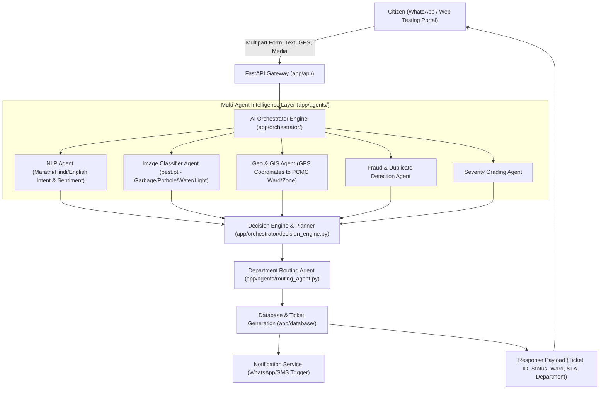

# PCMC Sarathi AI Platform - AI Orchestrator Pipeline Architecture

## 1. Executive Summary & Context
This document specifies the end-to-end architecture and execution pipeline for the **AI Orchestrator** powering the **WhatsApp-based Sarathi AI Platform for Pimpri Chinchwad Municipal Corporation (PCMC)**.

The `ai_orchestrator` acts as the central intelligence brain, fulfilling the technical specifications defined in the PCMC Tender BoQ:
- **Component B:** AI/NLP Engine Configuration, Training & MCP Server Layer (Intent Detection, Service Orchestration, Workflow Automation)
- **Component F:** Multilingual AI Enablement (Marathi, Hindi, English) for Text, Audio, Image & Document Understanding
- **Component L:** GIS, Geo-tagging & Geospatial Intelligence Module (Location Capture, Ward/Zone Mapping, Routing)
- **Component M:** Advanced AI Features (Duplicate Complaint Detection, Auto-routing, Severity Grading, Predictive Insights)
- **Section 3.4.2:** Grievance Redressal & Service Requests (Registration, Real-time Tracking, Auto-notifications, Feedback)

---

## 2. High-Level System Architecture

---

## 3. Detailed Component Pipeline

### 3.1. Grievance Ingestion & Preprocessing (`app/preprocessing/`)
- **Text Preprocessing:** Cleans and normalizes multilingual user inputs (Marathi Devanagari, Hindi, Hinglish, Marathi-English Roman script, and pure English).
- **Image Preprocessing:** Resizes, normalizes, and prepares incoming photos/media for the YOLO / PyTorch model (`best.pt`).
- **Geo-Coordinate Validation:** Extracts decimal Latitude and Longitude from WhatsApp location payload or browser GPS API.

### 3.2. Computer Vision Subsystem (`app/agents/image_agent.py`)
- **Model:** Pretrained weights at `models/image_classifier/best.pt`.
- **Target Classes & Department Mappings (11 Core Civic Categories):**
  1. `Drainage` (जलनिस्सारण व ड्रेनेज विभाग - SLA: 24h)
  2. `Garbage` (आरोग्य व घनकचरा व्यवस्थापन विभाग - SLA: 24h)
  3. `Pipeline / Water Supply Failure` (पाणीपुरवठा विभाग - SLA: 24h)
  4. `Pothole` (रस्ते व स्थापत्य विभाग - SLA: 48h)
  5. `Traffic Jams` (वाहतूक नियंत्रण कक्ष - SLA: 4h)
  6. `Streetlight` (विद्युत विभाग - SLA: 24h)
  7. `Trees` (उद्यान व वृक्ष प्राधिकरण विभाग - SLA: 48h)
  8. `Noise Pollution` (पर्यावरण व प्रदूषण नियंत्रण विभाग - SLA: 4h)
  9. `Encroachment` (अतिक्रमण निर्मूलन विभाग - SLA: 72h)
  10. `Electricity` (विद्युत विभाग / MSEDCL - SLA: 12h)
  11. `Unauthorized Banner & Flex` (आकाशचिन्ह व परवाना विभाग - SLA: 24h)
- **Output:** Class label, Confidence Score (0.0 to 1.0), and Bounding Box/Feature Metadata.

### 3.3. Multilingual NLP & Intent Detection (`app/agents/nlp_agent.py`)
- **Intent Extraction:** Distinguishes between:
  - `REGISTER_COMPLAINT` (तक्रार नोंदवणे)
  - `TRACK_COMPLAINT` (तक्रार स्थिती तपासणे)
  - `SERVICE_INQUIRY / FAQ` (माहिती विचारणे)
  - `BILL_QUERY` (कर/पाणीपट्टी माहिती)
  - `FEEDBACK_SUBMISSION` (अभिप्राय नोंदवणे)
- **Language Identification:** Marathi (मराठी), Hindi (हिंदी), English.

### 3.4. Geospatial & Ward Mapping Subsystem (`app/agents/geo_agent.py`)
- Maps GPS Coordinates `(latitude, longitude)` against PCMC administrative boundaries:
  - **Prabhag / Ward Numbers:** Ward 1 to Ward 32 (PCMC Administrative Boundaries).
  - **Zones:** Zone A, B, C, D, E, F, G, H.
- Identifies the assigned Ward Officer and Field Engineer automatically.

### 3.5. Duplicate Detection & Fraud Filter (`app/agents/fraud_agent.py`)
- Checks spatial proximity (within 50 meters) and temporal proximity (within last 48 hours) for complaints of the identical category.
- If a matching complaint is already active, the new report is linked as an endorsement/upvote to avoid duplicate municipal work orders.

### 3.6. Department Routing & Ticket Generation (`app/agents/routing_agent.py`)
- Assigns the standardized PCMC Ticket Number: `PCMC-YYYYMMDD-XXXX`.
- Maps the ticket to the respective PCMC ERP department:
  - `HEALTH_SWM` (Solid Waste Management)
  - `CIVIL_ROADS` (Road Maintenance & Potholes)
  - `WATER_SUPPLY` (Water Supply & Sewage)
  - `ELECTRICAL` (Street Lighting & Power)
  - `GARDEN_TREE` (Encroachment & Fallen Trees)
- Sets Service Level Agreement (SLA) deadlines (e.g., Pothole: 48 hours, Garbage: 24 hours, Streetlight: 24 hours).

---

## 4. Lifecycle of a Civic Grievance

| Status Stage | Description | Actor / Trigger | Citizen Notification |
| :--- | :--- | :--- | :--- |
| `REGISTERED` | Grievance captured, categorized by AI, Ticket ID generated. | System (AI Orchestrator) | WhatsApp confirmation with Ticket ID & SLA date. |
| `ASSIGNED` | Assigned to Junior Engineer / Ward Sanitary Inspector. | Routing Engine | Notification: Assigned officer details & contact. |
| `IN_PROGRESS` | Work order issued; field staff dispatched. | Ward Officer Dashboard | Notification: Field team on site. |
| `RESOLVED` | Issue resolved; resolution photograph uploaded by officer. | Field Officer | Notification with Before/After photo proof. |
| `CLOSED` | Citizen confirms resolution and provides 1-5 star feedback. | Citizen Confirmation | Thank you message + Feedback recorded. |

---

## 5. API Endpoints Specification

### 5.1. Grievance Management (`app/api/routes/complaint.py`)
- `POST /api/v1/complaints/register`:
  - **Payload (Multipart):** `description` (str), `latitude` (float), `longitude` (float), `citizen_phone` (str), `photo` (UploadFile).
  - **Response:** `ticket_id`, `detected_category`, `confidence`, `ward`, `assigned_department`, `sla_hours`, `status`.
- `GET /api/v1/complaints/{ticket_id}/status`:
  - **Response:** Current lifecycle status, assigned officer, resolution history, timeline logs.
- `PATCH /api/v1/complaints/{ticket_id}/update-status`:
  - **Admin / Field Officer Action:** Update to `IN_PROGRESS` or `RESOLVED` with optional proof image.
- `POST /api/v1/complaints/{ticket_id}/feedback`:
  - **Payload:** `rating` (1 to 5), `comments` (str), `confirmed_resolved` (bool).

### 5.2. Testing Frontend Portal (`app/static/index.html`)
- A modern, responsive citizen & admin testing console providing:
  - Live photo upload with instant image preview.
  - One-click browser geolocation retrieval.
  - Multi-category sample prompt selector.
  - Interactive AI categorization breakdown & confidence gauge.
  - Real-time grievance tracking timeline and star feedback rating module.

---

### 3.7. LLM Provider Hierarchy & Token Cost Optimization Strategy
To eliminate unnecessary API costs, the system follows a strict **3-Tier Execution Hierarchy**:
1. **Tier 1 - Deterministic & Local Vision/Rules (Zero Token Cost):**
   - Image classification is handled exclusively via the local PyTorch/YOLO model (`best.pt`).
   - Standard keyword/regex patterns in Marathi/English are evaluated first.
2. **Tier 2 - Primary LLM: Free Local Ollama (`http://localhost:11434`):**
   - Complex intents, natural language summarization, and translation default to a locally hosted Ollama instance (e.g., `llama3`, `mistral`, or `qwen2.5`).
   - Runs 100% free with zero cloud token consumption.
3. **Tier 3 - Secondary Fallback: OpenAI API (`OPENAI_API_KEY`):**
   - Triggered **only if** Ollama is offline, unreachable, timed out, or returns a parsing failure.
   - Uses optimized, compressed system prompts to minimize token usage strictly when active.
   - If no API key is provided, the engine gracefully degrades to rule-based defaults without crashing.

---

## 6. Technology Stack
- **Framework:** FastAPI (Python 3.10+)
- **Computer Vision:** PyTorch / Ultralytics YOLO (`models/image_classifier/best.pt`)
- **Primary LLM:** Local Ollama (Free Tier)
- **Fallback LLM:** OpenAI API (Cost-optimized, only on failure)
- **Database:** SQLite (local development/testing) / PostgreSQL (production)
- **Validation:** Pydantic v2
- **Documentation:** OpenAPI / Swagger UI at `/docs`

