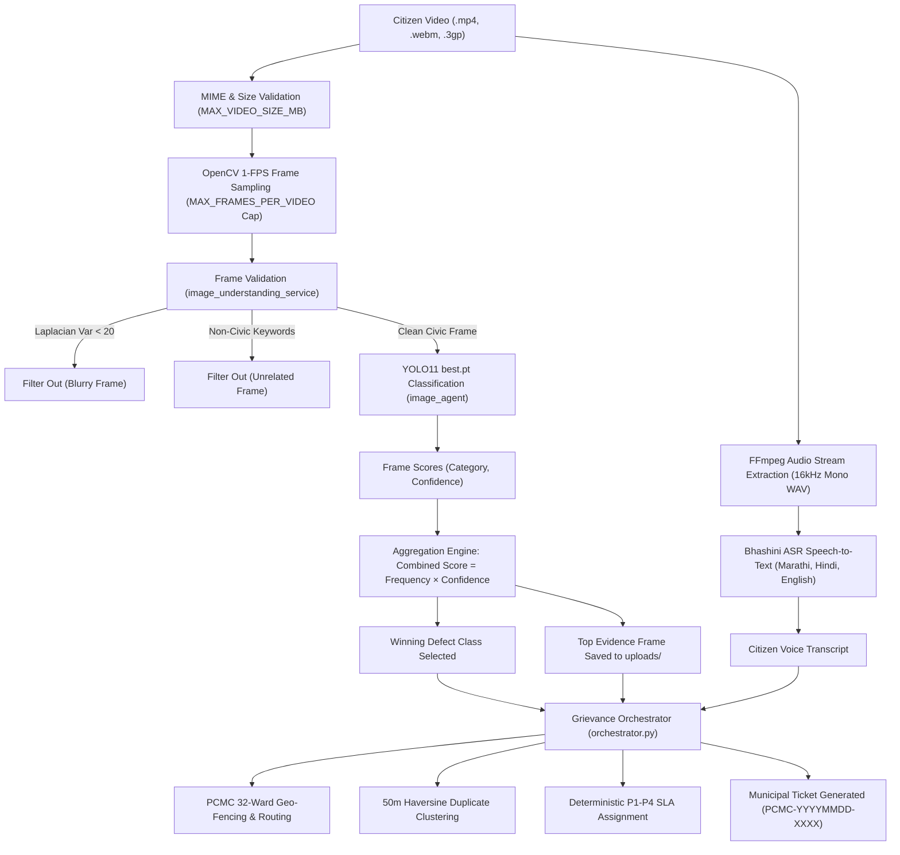

# PCMC WardMitra — Video Ingestion Pipeline

## Overview
The Video Ingestion Pipeline enables citizens of Pimpri Chinchwad Municipal Corporation (PCMC) to report civic issues (potholes, garbage dumps, broken streetlights, water leakages, drainage overflows) by recording and uploading short video clips (MP4, WebM, 3GP).

The pipeline automatically:
1. Validates the video duration, file size, and MIME type.
2. Extracts 1 frame per second via OpenCV temporal sampling (capped at `MAX_FRAMES_PER_VIDEO`).
3. Discards blurry frames (Laplacian variance check) and non-civic frames using the existing `image_understanding_service.py`.
4. Passes valid civic frames into the custom fine-tuned YOLO11 `best.pt` model.
5. Aggregates frame-level classifications using a `(frequency × confidence)` voting formula.
6. Persists the single highest-confidence frame as the primary municipal evidence photo.
7. Extracts the video's audio track via FFmpeg and transcribes citizen voice via Digital India Bhashini ASR.
8. Passes the result into the unified municipal redressal orchestrator (32 PCMC wards, Haversine duplicate clustering, fraud scoring, P1-P4 SLA calculation, and ticket creation).

---

## Architecture Diagram



---

## Configuration Settings (`.env`)

| Variable | Default | Description |
| :--- | :--- | :--- |
| `MAX_VIDEO_DURATION_SEC` | `60` | Maximum allowable video clip length in seconds. |
| `MAX_FRAMES_PER_VIDEO` | `30` | Maximum number of frames analyzed per video to cap compute costs. |
| `MAX_VIDEO_SIZE_MB` | `10` | Maximum file upload size limit in megabytes. |
| `VIDEO_PROCESSING_TIMEOUT_SEC`| `45.0` | Timeout threshold for video processing operations. |

---

## API Endpoints

### 1. Dedicated Video Ingestion Endpoint
- **URL**: `POST /api/v1/complaints/register-video`
- **Content-Type**: `multipart/form-data`
- **Parameters**:
  - `video` (file, required): Video file (`.mp4`, `.webm`, `.3gp`, `.mov`, `.avi`).
  - `description` (string, optional): Citizen's text explanation. If omitted, speech transcript is used.
  - `latitude` (float, optional): Citizen GPS latitude.
  - `longitude` (float, optional): Citizen GPS longitude.
  - `citizen_phone` (string, optional, default: `"9876543210"`): Citizen mobile number.
  - `ward_number` (int, optional): PCMC Ward number (1–32).
  - `priority` (string, optional): Priority override (LOW, MEDIUM, HIGH).
  - `language` (string, default: `"mr"`): Audio language code (`"mr"`, `"hi"`, `"en"`).

- **Response (`201 Created`)**:
```json
{
  "ticket_id": "PCMC-20260921-4821",
  "detected_category": "pothole",
  "category_name_mr": "रस्ते व स्थापत्य (खड्डे)",
  "confidence": 0.885,
  "priority": "MEDIUM",
  "severity": "MEDIUM",
  "is_emergency": false,
  "assigned_department": "CIVIL_ROADS",
  "ward": 25,
  "sla_hours": 48,
  "status": "REGISTERED",
  "photo_path": "C:\\...\\uploads\\EVIDENCE_VIDEO_b48f...jpg",
  "video_path": "C:\\...\\uploads\\VIDEO_79c1...mp4",
  "video_details": {
    "category": "pothole",
    "confidence": 0.885,
    "transcript": "वाकड चौकात डांबरी रस्त्यावर मोठा खड्डा पडला आहे",
    "detected_language": "mr",
    "frame_count": 5,
    "duration_sec": 5.0,
    "frames_analyzed": 5,
    "frames_rejected_blur": 0,
    "frames_rejected_noncivic": 0,
    "combined_scores": {
      "pothole": 4.425
    }
  },
  "message": "तक्रार यशस्वीरीत्या नोंदवली गेली. तिकीट क्र: PCMC-20260921-4821 (प्राधान्य: P3)"
}
```

### 2. Unified Registration Endpoint
- **URL**: `POST /api/v1/complaints/register`
- Accepts both `photo` and `video` multipart parameters seamlessly.
